[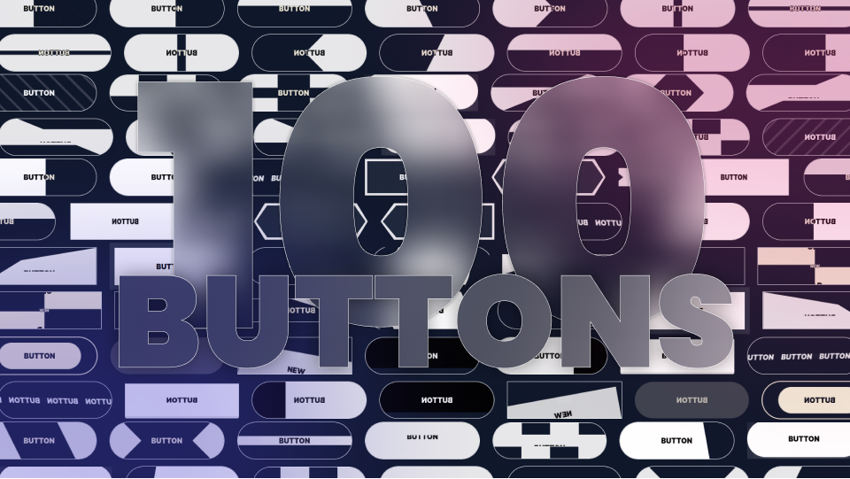](https://css-buttons.web.app)

## :robot: To See Code, Click on One of The Links

| Preview | Link | Description |
| --- | --- | --- |
|  | [Basic](https://css-buttons.web.app/button/?id=1) | CSS Button that slightly changes color on hover or click. |
|  | [Slide Right](https://css-buttons.web.app/button/?id=2) | CSS Button that slides its background to the right on hover or click. |
|  | [Slide Down](https://css-buttons.web.app/button/?id=3) | CSS Button that slides its background to the bottom on hover or click. |
|  | [Slide Diagonal](https://css-buttons.web.app/button/?id=4) | CSS Button that slides its tilted background to the right on hover or click. |
|  | [Slide Triangle](https://css-buttons.web.app/button/?id=5) | CSS Button that slides its triangular pseudo-element background to the right on hover or click. |
|  | [Double Horizontal](https://css-buttons.web.app/button/?id=6) | CSS Button that slides its two pseudo-element bgrounds to the center on hover or click. |
|  | [Double Vertical](https://css-buttons.web.app/button/?id=7) | CSS Button that vertically slides its two pseudo-element backgrounds to the center on hover or click. |
| [ 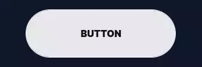](https://css-buttons.web.app/button/?id=8) | [Double Diagonal](https://css-buttons.web.app/button/?id=8) | CSS Button that horizontally slides its two tilted diagonal pseudo-element backgrounds to the center on hover or click. |
| [ 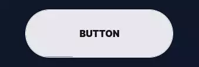](https://css-buttons.web.app/button/?id=9) | [Double Arrow](https://css-buttons.web.app/button/?id=9) | CSS Button that slides its two triangular pseudo-element backgrounds to the center on hover or click. |
|  | [Click To Fill](https://css-buttons.web.app/button/?id=10) | CSS Button that fills a thin rectangle and fills the entire button on hover or click. |
|  | [Pattern Background](https://css-buttons.web.app/button/?id=11) | CSS Button that shows a scrolling pattern grid background and fills up on hover or click. |
|  | [Alternate Slide](https://css-buttons.web.app/button/?id=12) | CSS Button that slides 4 blocks of background in an alternate animation on hover or click. |
| [ 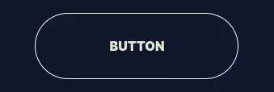](https://css-buttons.web.app/button/?id=13) | [4 Corners](https://css-buttons.web.app/button/?id=13) | CSS Button that moves 4 corners to the center on hover or click. |
|  | [Float Up](https://css-buttons.web.app/button/?id=14) | CSS Button that floats up and reveals a large box shadow on hover or click. |
|  | [Slice](https://css-buttons.web.app/button/?id=15) | CSS Button that slices in half on hover or click. |
|  | [Inverted Triangles](https://css-buttons.web.app/button/?id=16) | CSS Button that slides two flipped triangles on hover or click. |
| [ 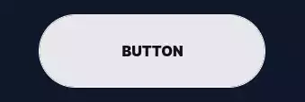](https://css-buttons.web.app/button/?id=17) | [Slice + Text Rotate](https://css-buttons.web.app/button/?id=17) | CSS Button that slices in half and rotates its text on hover or click. |
|  | [Zoom In + Text Rotate](https://css-buttons.web.app/button/?id=18) | CSS Button that slides two inward-pointing pseudo-element triangles to the center on hover or click. |
| [ 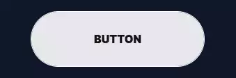](https://css-buttons.web.app/button/?id=19) | [Alternate + Text Rotate](https://css-buttons.web.app/button/?id=19) | CSS Button that slides 4 blocks of background with an alternate animation and rotates its text on hover or click. |
|  | [Tilted Diagonal](https://css-buttons.web.app/button/?id=20) | CSS Button that slides a horizontal tilted background pseudo-element that keeps tilting even more on hover or click. |
| [ 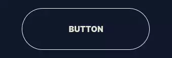](https://css-buttons.web.app/button/?id=21) | [Come In Come Out](https://css-buttons.web.app/button/?id=21) | CSS Button that slides its background from the left and onto the right on hover or click. |
| [ 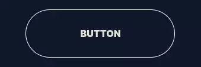](https://css-buttons.web.app/button/?id=22) | [Bubble Right](https://css-buttons.web.app/button/?id=22) | CSS Button that slides its radial background to the right on hover or click. |
| [ 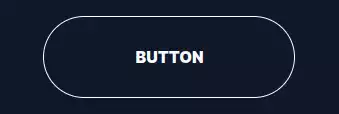](https://css-buttons.web.app/button/?id=23) | [Marquee Text](https://css-buttons.web.app/button/?id=23) | CSS Button that moves copies of its text horizontally and at an angle on hover or click. |
| [ 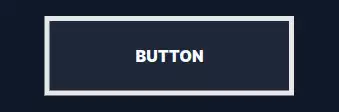](https://css-buttons.web.app/button/?id=24) | [ShapeShifter](https://css-buttons.web.app/button/?id=24) | CSS Button that morphs one side of its border into a triangle pseudo-element on hover or click. |
|  | [Double ShapeShifter](https://css-buttons.web.app/button/?id=25) | CSS Button that morphs both sides into a triangle pseudo-element on hover or click. |
|  | [X ShapeShifter](https://css-buttons.web.app/button/?id=26) | CSS Button that morphs into an X using pseudo-elements on hover or click. |
| [ 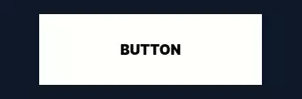](https://css-buttons.web.app/button/?id=27) | [Fold Middle](https://css-buttons.web.app/button/?id=27) | CSS Button that folds from the middle using CSS 3D Transforms on hover or click. |
| [ 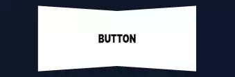](https://css-buttons.web.app/button/?id=28) | [Fold One Side](https://css-buttons.web.app/button/?id=28) | CSS Button that folds from one side using CSS 3D Transforms on hover or click. |
|  | [Arrow Slide + Text Rotate](https://css-buttons.web.app/button/?id=29) | CSS Button that slides its triangular background from the left to the right and rotates its text on hover or click. |
|  | [Bubble Up + Text Rotate](https://css-buttons.web.app/button/?id=30) | CSS Button that slides its bubbly radial background to the bottom and rotates its text on hover or click. |
|  | [OverFold](https://css-buttons.web.app/button/?id=31) | CSS Button that moves one corner from the bottom right to the top left to reveal its background on hover or click. |
|  | [Focus In](https://css-buttons.web.app/button/?id=32) | CSS Button that focuses its border in on hover or click. |
|  | [Vertical Marquee](https://css-buttons.web.app/button/?id=33) | CSS Button that translates its text vertically on hover or click. |
|  | [Enlarge](https://css-buttons.web.app/button/?id=34) | CSS Button that fills up its background radially from the center and scales up on hover or click. |
| [ 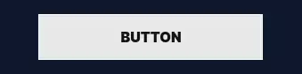](https://css-buttons.web.app/button/?id=35) | [Slanted](https://css-buttons.web.app/button/?id=35) | CSS Button that tilts its background from the top left corner on hover or click. |
| [ 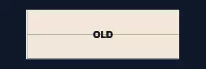](https://css-buttons.web.app/button/?id=36) | [Split Reveal](https://css-buttons.web.app/button/?id=36) | CSS Button that reveals new text by splitting it horizontally from the center on hover or click. |
|  | [Split Reveal Alternate](https://css-buttons.web.app/button/?id=37) | CSS Button that reveals new text by splitting it alternately from the center on hover or click. |
| [ 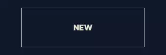](https://css-buttons.web.app/button/?id=38) | [Split Reveal Horizontal](https://css-buttons.web.app/button/?id=38) | CSS Button that reveals new text by splitting it horizontally from the center on hover or click. |
|  | [Slide Reveal](https://css-buttons.web.app/button/?id=39) | CSS Button that reveals new text by sliding it to the right on hover or click. |
|  | [Slide Reveal + Text Down](https://css-buttons.web.app/button/?id=40) | CSS Button that reveals new text by sliding it to the right and sliding the old text down on hover or click. |
|  | [Pill Shrink](https://css-buttons.web.app/button/?id=41) | CSS Button that scales its pill-like background down on hover or click. |
|  | [Pill Halo](https://css-buttons.web.app/button/?id=42) | CSS Button that focuses in its pill-like border on hover or click. |
|  | [Rotate Reveal](https://css-buttons.web.app/button/?id=43) | CSS Button that reveals new text by rotating it in from the bottom left on hover or click. |
|  | [Double Slide Down](https://css-buttons.web.app/button/?id=44) | CSS Button that slides its two backgrounds successively to the bottom on hover or click. |
|  | [Double Slide Right](https://css-buttons.web.app/button/?id=45) | CSS Button that slides its two backgrounds successively to the right on hover or click. |
|  | [3D Rotate Down](https://css-buttons.web.app/button/?id=46) | CSS Button that rotates down using 3D Transforms on hover or click. |
|  | [3D Rotate Right](https://css-buttons.web.app/button/?id=47) | CSS Button that rotates right using 3D Transforms on hover or click. |
|  | [3D Rotate Left](https://css-buttons.web.app/button/?id=48) | CSS Button that rotates left using 3D Transforms on hover or click. |
|  | [3D Rotate Down](https://css-buttons.web.app/button/?id=49) | CSS Button that rotates up using 3D Transforms on hover or click. |
|  | [3D Float](https://css-buttons.web.app/button/?id=50) | CSS Button that has a large box shadow and that tilts down using 3D Transforms on hover or click. |
| [ 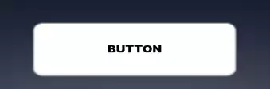](https://css-buttons.web.app/button/?id=51) | [3D Button Click](https://css-buttons.web.app/button/?id=51) | CSS Button that pushes itself down in 3D space on hover or click. |
|  | [Letter Dance](https://css-buttons.web.app/button/?id=52) | CSS Button that slides its characters down successively one after the other on hover or click. |
|  | [Letter Dance 2](https://css-buttons.web.app/button/?id=53) | CSS Button that slides its characters up and down alternately on hover or click. |
|  | [3D Button 2](https://css-buttons.web.app/button/?id=54) | CSS Button that simulates 3D using html elements and that pushes down on hover or click. |
| [ 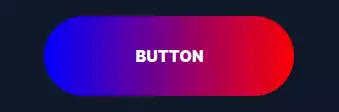](https://css-buttons.web.app/button/?id=55) | [Rainbow Fill](https://css-buttons.web.app/button/?id=55) | CSS Button that reveals its fun rainbow gradient background sitting inside of its rainbow gradient image border on hover or click. |
|  | [Pulse](https://css-buttons.web.app/button/?id=56) | CSS Button that pulsates on hover on hover or click. |
| [ 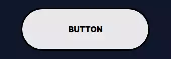](https://css-buttons.web.app/button/?id=57) | [Offset](https://css-buttons.web.app/button/?id=57) | CSS Button that moves its background back into-place on hover or click. |
|  | [Backdrop Blur](https://css-buttons.web.app/button/?id=58) | CSS Button that overlays a blurry layer on its background on hover or click. |
|  | [Tada!](https://css-buttons.web.app/button/?id=59) | CSS Button that plays the TADA animation from animate.css on hover or click. |
|  | [ⱼₑₗₗₒ](https://css-buttons.web.app/button/?id=60) | CSS Button that plays the jello animation from animate.css on hover or click. |
| [ 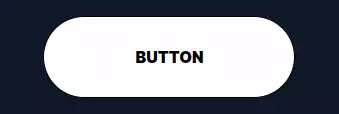](https://css-buttons.web.app/button/?id=61) | [Ｒｕｂｂｅｒｂａｎｄ](https://css-buttons.web.app/button/?id=61) | CSS Button that plays the rubberband animation from animate.css on hover or click. |
|  | [𝕎𝕠𝕓𝕓𝕝𝕖](https://css-buttons.web.app/button/?id=62) | CSS Button that plays the wobble animation from animate.css on hover or click. |
|  | [𝙃𝙚𝙖𝙙 𝙎𝙝𝙖𝙠𝙚](https://css-buttons.web.app/button/?id=63) | CSS Button that plays the head-shake animation from animate.css on hover or click. |
|  | [ᕼEᗩᖇT ᗷEᗩT](https://css-buttons.web.app/button/?id=64) | CSS Button that plays the heart-beat animation from animate.css on hover or click. |
|  | [F̾l̾a̾s̾h̾](https://css-buttons.web.app/button/?id=65) | CSS Button that plays the flash animation from animate.css on hover or click. |
|  | [Text Slide](https://css-buttons.web.app/button/?id=66) | CSS Button that slides a copy of its text vertically with another color on hover or click. |
| [ 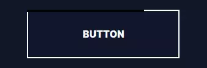](https://css-buttons.web.app/button/?id=67) | [Border Snake](https://css-buttons.web.app/button/?id=67) | CSS Button that has borders that fill-up one after another on hover or click. |
| [ 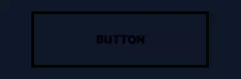](https://css-buttons.web.app/button/?id=68) | [Snakes Alternate](https://css-buttons.web.app/button/?id=68) | CSS Button that has borders filling up from the parallel sides on hover or click. |
|  | [Snakes Meet](https://css-buttons.web.app/button/?id=69) | CSS Button that has borders filling up to meet at 2 points on hover or click. |
|  | [Snakes Center](https://css-buttons.web.app/button/?id=70) | CSS Button that has borders filling up from the center on hover or click. |
| [ 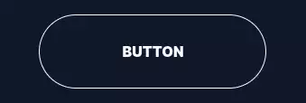](https://css-buttons.web.app/button/?id=71) | [Material Ripple](https://css-buttons.web.app/button/?id=71) | CSS Button that fills up its background radially from the center then fades out on hover or click. |
|  | [Neumorphism 1](https://css-buttons.web.app/button/?id=72) | CSS Button that has a fluffy shadow that moves to the inside on hover or click. |
| [ 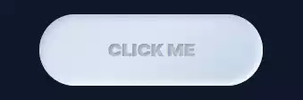](https://css-buttons.web.app/button/?id=73) | [Neumorphism 2](https://css-buttons.web.app/button/?id=73) | CSS Button that has a fluffy shadow and text with a 3D effect using text shadows and that moves to the inside on hover or click. |
|  | [Neumorphism 3](https://css-buttons.web.app/button/?id=74) | CSS Button that has a fluffy shadow that smoothly moves to the inside on hover or click. |
|  | [Neumorphism 4](https://css-buttons.web.app/button/?id=75) | CSS Button that moves down on hover or click. |
| [ 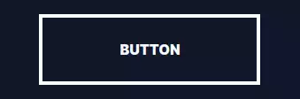](https://css-buttons.web.app/button/?id=76) | [Neon](https://css-buttons.web.app/button/?id=76) | CSS Button that has borders filling up slowly then revealing a large neon shadow on hover or click. |
|  | [I Want Attention](https://css-buttons.web.app/button/?id=77) | CSS Button that keeps pulsing on hover or click. |
|  | [Hug](https://css-buttons.web.app/button/?id=78) | CSS Button that moves its background from the outside to the inside on hover or click. |
|  | [Hug 2](https://css-buttons.web.app/button/?id=79) | CSS Button that moves its background closer from the outside to the inside on hover or click. |
|  | [Progress Fill Right](https://css-buttons.web.app/button/?id=80) | CSS Button that has a background that slowly fills up with a progress animation on hover or click. |
|  | [Progress Fill Up](https://css-buttons.web.app/button/?id=81) | CSS Button that has a background that slowly fills up vertically on hover or click. |
| [ 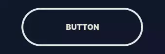](https://css-buttons.web.app/button/?id=82) | [Progress Shrink Vertical](https://css-buttons.web.app/button/?id=82) | CSS Button that shrinks into a progress-bar vertically on hover or click. |
|  | [Progress Shrink Vertical](https://css-buttons.web.app/button/?id=83) | CSS Button that shrinks into a progress-bar horizontally on hover or click. |
|  | [3D Progress](https://css-buttons.web.app/button/?id=84) | CSS Button that tilts in 3D space to reveal a horizontal progress-bar on hover or click. |
|  | [Elastic Progress](https://css-buttons.web.app/button/?id=85) | CSS Button that shrinks into a horizontal progress-bar in a smooth and elastic animation on hover or click. |
|  | [Letter Dance 3](https://css-buttons.web.app/button/?id=86) | CSS Button that double-fills its background and plays an elastic animation with its characters on hover or click. |
|  | [Circular Charge](https://css-buttons.web.app/button/?id=87) | CSS Button that has a circular border that is clipped and fills up then fills up the background on hover or click. |
|  | [Icon Pulse](https://css-buttons.web.app/button/?id=88) | CSS Button that scales its background like a pulse on hover or click. |
|  | [Icon Slide](https://css-buttons.web.app/button/?id=89) | CSS Button that slides vertically inside its borders on hover or click. |
|  | [Gooey](https://css-buttons.web.app/button/?id=90) | CSS Button that moves two circles closer to each other that have a gooey and slimy effect on hover or click. |
|  | [Seizure Glitch](https://css-buttons.web.app/button/?id=91) | CSS Button that plays an RGB split animation on hover or click. |
|  | [HandDrawn 1](https://css-buttons.web.app/button/?id=92) | CSS Button that has borders mimicking hand-drawn edges on hover or click. |
|  | [HandDrawn 2](https://css-buttons.web.app/button/?id=93) | CSS Button that has borders mimicking hand-drawn edges and floats up on hover or click. |
|  | [Icon Zoom](https://css-buttons.web.app/button/?id=94) | CSS Button that scales down inside its borders on hover or click. |
|  | [Icon Focus](https://css-buttons.web.app/button/?id=95) | CSS Button that has a border scaling in on it on hover or click. |
| [ 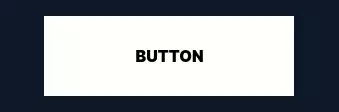](https://css-buttons.web.app/button/?id=96) | [Progress Fold](https://css-buttons.web.app/button/?id=96) | CSS Button that paper-folds one side to reveal a progress-bar on hover or click. |
|  | [Sandwish](https://css-buttons.web.app/button/?id=97) | CSS Button that moves up many shadows successively on hover or click. |
|  | [Line Slide](https://css-buttons.web.app/button/?id=98) | CSS Button that slides its pseudo-element underline on hover or click. |
|  | [Don't Cross The Line](https://css-buttons.web.app/button/?id=99) | CSS Button that crosses over itself and expands on hover or click. |
|  | [Cover Over](https://css-buttons.web.app/button/?id=100) | CSS Button that has a pseudo-element background going over it and out on hover or click. |

## :triangular_flag_on_post: License

As per the [**GPL-3.0 license**](./LICENSE), you are allowed to —

- Use these buttons **individually** in any shape or form you like, whether it’s a personal or commercial project, and whether it’s open-source or closed-source.

##  :open_hands: Acknowledgments

Some of these buttons were inspired from various sources. Here are the most prominent ones:

- [Tympanus Button Styles](https://tympanus.net/Development/ButtonStylesInspiration/)

